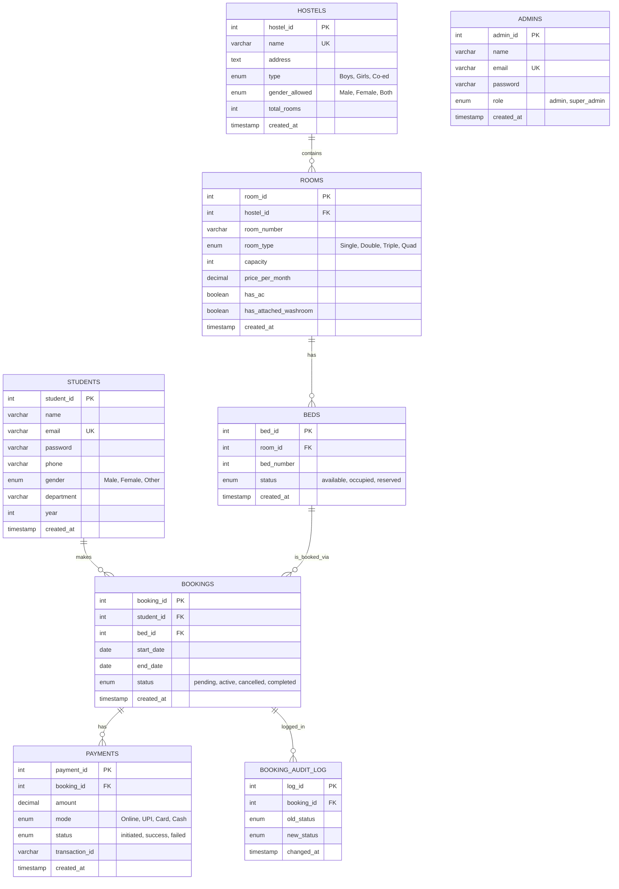

# DormEase - Entity-Relationship Diagram

This document contains the ER diagram for the DormEase Hostel Management System.

## ER Diagram

## Relationship Details

### 1. HOSTELS ↔ ROOMS
- **Relationship**: One-to-Many
- **Cardinality**: One hostel contains zero or more rooms
- **Foreign Key**: `rooms.hostel_id` references `hostels.hostel_id`
- **Delete Rule**: CASCADE (deleting a hostel deletes all its rooms)

### 2. ROOMS ↔ BEDS
- **Relationship**: One-to-Many
- **Cardinality**: One room has zero or more beds
- **Foreign Key**: `beds.room_id` references `rooms.room_id`
- **Delete Rule**: CASCADE (deleting a room deletes all its beds)

### 3. STUDENTS ↔ BOOKINGS
- **Relationship**: One-to-Many
- **Cardinality**: One student makes zero or more bookings
- **Foreign Key**: `bookings.student_id` references `students.student_id`
- **Delete Rule**: CASCADE (deleting a student deletes all their bookings)
- **Business Rule**: A student can have only ONE active/pending booking at a time (enforced by trigger)

### 4. BEDS ↔ BOOKINGS
- **Relationship**: One-to-Many
- **Cardinality**: One bed can be booked zero or more times (across different time periods)
- **Foreign Key**: `bookings.bed_id` references `beds.bed_id`
- **Delete Rule**: CASCADE (deleting a bed deletes all its bookings)
- **Business Rule**: A bed cannot have overlapping bookings (enforced by trigger)

### 5. BOOKINGS ↔ PAYMENTS
- **Relationship**: One-to-Many
- **Cardinality**: One booking has zero or more payments
- **Foreign Key**: `payments.booking_id` references `bookings.booking_id`
- **Delete Rule**: CASCADE (deleting a booking deletes all its payments)

### 6. BOOKINGS ↔ BOOKING_AUDIT_LOG
- **Relationship**: One-to-Many
- **Cardinality**: One booking has zero or more audit log entries
- **Purpose**: Track all status changes for auditing
- **Populated By**: Trigger `after_booking_status_change`

## Key Constraints

### Primary Keys
- All tables have an auto-incrementing integer primary key
- Naming convention: `{table_name}_id`

### Unique Constraints
1. **hostels.name** - Hostel names must be unique
2. **students.email** - Student emails must be unique
3. **admins.email** - Admin emails must be unique
4. **(hostel_id, room_number)** - Room numbers unique within a hostel
5. **(room_id, bed_number)** - Bed numbers unique within a room

### Foreign Key Constraints
All foreign keys use `ON DELETE CASCADE` to maintain referential integrity.

## Indexes

### Performance Indexes
1. **idx_student_email_dept** - `students(email, department)`
2. **idx_room_hostel** - `rooms(hostel_id)`
3. **idx_bed_room_status** - `beds(room_id, status)`
4. **idx_booking_student_status** - `bookings(student_id, status)`
5. **idx_booking_dates** - `bookings(start_date, end_date)`
6. **idx_payment_booking** - `payments(booking_id)`
7. **idx_payment_status_date** - `payments(status, created_at)`

## Business Rules Enforced

### Database-Level (Triggers)
1. **Bed Availability**: Beds must be 'available' to be booked
2. **No Overlapping Bookings**: Same bed cannot have overlapping date ranges
3. **One Active Booking**: Students can have only one active/pending booking
4. **Date Validation**: End date must be after start date
5. **Payment Amount**: Must match room rent or rent + security deposit (₹5000)
6. **Auto Status Update**: Bed status changes when booking status changes
7. **Audit Logging**: All booking status changes are logged

### Application-Level
1. **Gender Restrictions**: Students can only book hostels matching their gender
2. **Authentication**: Password hashing using bcrypt
3. **Session Management**: Iron-session for secure sessions

## Entity Descriptions

### HOSTELS
Represents physical hostel buildings with their basic information and configuration.

### ROOMS
Individual rooms within hostels, with pricing and amenity information.

### BEDS
Individual beds within rooms, tracked for availability and booking.

### STUDENTS
User accounts for students who can book beds.

### ADMINS
Administrative user accounts with elevated privileges.

### BOOKINGS
Reservation records linking students to beds for specific date ranges.

### PAYMENTS
Financial transaction records for booking payments.

### BOOKING_AUDIT_LOG
Audit trail for tracking all booking status changes over time.

## Normalization Level

The database schema is in **Third Normal Form (3NF)**:

1. **1NF**: All attributes contain atomic values
2. **2NF**: No partial dependencies (all non-key attributes depend on entire primary key)
3. **3NF**: No transitive dependencies (no non-key attribute depends on another non-key attribute)

### Example of 3NF:
- Room price is stored in `rooms` table, not in `bookings`
- Student information is in `students` table, not duplicated in `bookings`
- Hostel information is in `hostels` table, not duplicated in `rooms`

## Functional Dependencies

### HOSTELS
- hostel_id → name, address, type, gender_allowed, total_rooms

### ROOMS
- room_id → hostel_id, room_number, room_type, capacity, price_per_month, has_ac, has_attached_washroom
- (hostel_id, room_number) → room_id

### BEDS
- bed_id → room_id, bed_number, status
- (room_id, bed_number) → bed_id

### STUDENTS
- student_id → name, email, password, phone, gender, department, year
- email → student_id

### BOOKINGS
- booking_id → student_id, bed_id, start_date, end_date, status

### PAYMENTS
- payment_id → booking_id, amount, mode, status, transaction_id

## Views (Derived Entities)

The system includes 4 views that provide abstracted data access:

1. **available_rooms_summary** - Aggregated room availability data
2. **student_booking_details** - Complete booking information with joins
3. **monthly_revenue_report** - Revenue analytics by month and hostel
4. **hostel_occupancy_overview** - Real-time occupancy statistics

These views are not shown in the ER diagram as they are derived from base tables.
